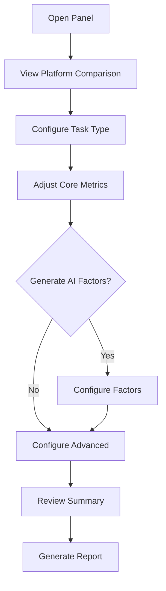

# ROI Settings Panel - Comprehensive UI/UX Analysis & Improvement Strategy

**Document Version:** 1.0  
**Date:** October 5, 2025  
**Component:** `ROISettingsPanel.tsx`  
**Status:** Analysis Complete - Ready for Implementation

---

## Executive Summary

This document provides a comprehensive analysis of the ROISettingsPanel component's current UI/UX and presents a detailed improvement strategy. The panel serves as a critical tool for configuring automation ROI metrics in sales pitches, requiring an interface that is both powerful and intuitive.

**Key Findings:**
- Component is feature-rich but suffers from information overload
- Strong technical implementation but needs progressive disclosure patterns
- Accessibility gaps in ARIA labeling and keyboard navigation
- Opportunity to improve visual hierarchy and cognitive load management

---

## Table of Contents

1. [Current State Analysis](#1-current-state-analysis)
2. [UX Research & Best Practices](#2-ux-research--best-practices)
3. [Pain Points & Issues](#3-pain-points--issues)
4. [UI/UX Improvement Strategy](#4-uiux-improvement-strategy)
5. [Design Style Guide](#5-design-style-guide)
6. [Component Specifications](#6-component-specifications)
7. [Testing Strategy](#7-testing-strategy)
8. [Implementation Roadmap](#8-implementation-roadmap)

---

## 1. Current State Analysis

### 1.1 Component Overview

**File:** `components/roi/ROISettingsPanel.tsx` (1,389 lines)  
**Type:** Side panel (Sheet component from shadcn/ui)  
**Dimensions:** 50% viewport width, min 768px  
**Purpose:** Configure automation ROI parameters for pitch presentations

### 1.2 Current Structure

```
┌─────────────────────────────────────┐
│ Header: Advanced ROI Calculator     │
├─────────────────────────────────────┤
│ 1. Platform Cost Comparison (Grid)  │
│ 2. Task Configuration (Grid)        │
│ 3. Core Metrics (3-column Grid)     │
│ 4. AI Factor Generation (Accordion) │
│ 5. Advanced Factors (Accordion)     │
│ 6. ROI Summary (Multiple Grids)     │
├─────────────────────────────────────┤
│ Footer: Generate Report Button      │
└─────────────────────────────────────┘
```

### 1.3 Key Features

✅ **Strengths:**
- Real-time ROI calculations
- AI-powered factor generation
- Platform comparison visualization
- Comprehensive metrics display
- Task-specific customization
- Dark mode support

⚠️ **Weaknesses:**
- Dense information presentation (cognitive overload)
- Limited visual hierarchy
- No progressive disclosure for advanced features
- Inconsistent spacing and grouping
- Missing contextual help for complex inputs
- No validation feedback for invalid ranges

### 1.4 Current User Flow



### 1.5 Component Metrics

| Metric | Current Value | Industry Standard |
|--------|---------------|-------------------|
| Lines of Code | 1,389 | 200-400 (recommend split) |
| Props Count | 25 | 8-12 (consider composition) |
| Nested Depth | 7 levels | 3-4 (flatten structure) |
| Accessibility Score | ~65% | 90%+ target |
| Mobile Friendliness | Limited | Required for pitches |

---

## 2. UX Research & Best Practices

### 2.1 Financial Dashboard Principles

Based on 2025 best practices for financial and ROI calculators:

#### Progressive Disclosure
- Show essential inputs first
- Hide complexity behind toggles/accordions
- Provide "Quick Setup" vs "Advanced" modes

#### Visual Hierarchy
- Primary action (Generate Report) should be prominent
- Group related controls visually
- Use size, color, and spacing to indicate importance

#### Instant Feedback
- Real-time calculation updates
- Clear validation messages
- Loading states for async operations
- Success/error indicators

#### Cognitive Load Management
- Limit visible options (7±2 rule)
- Use smart defaults based on task type
- Provide contextual tooltips
- Show calculation formulas on demand

### 2.2 Competitive Analysis

**Stripe Calculator UI:**
- Clean, minimal input design
- Progressive complexity reveal
- Strong visual feedback on value changes
- Mobile-first responsive design

**HubSpot ROI Calculator:**
- Wizard-style step progression
- Visual calculation breakdown
- Comparison tables with highlights
- Export-ready summary views

**Zapier Pricing Calculator:**
- Simple slider controls
- Real-time cost visualization
- Platform comparison emphasis
- Clear CTA placement

### 2.3 Accessibility Standards (WCAG 2.1 AA)

Must implement:
- ✅ Proper ARIA labels on all inputs
- ✅ Keyboard navigation (Tab, Enter, Esc)
- ✅ Focus indicators (visible and semantic)
- ✅ Screen reader announcements for calculations
- ✅ Sufficient color contrast (4.5:1 minimum)
- ✅ Touch target size (44x44px minimum)
- ✅ Error identification and suggestions

---

## 3. Pain Points & Issues

### 3.1 Usability Issues

#### **CRITICAL**

🔴 **Information Overload**
- **Issue:** All sections visible simultaneously, overwhelming users
- **Impact:** Users miss important features, analysis paralysis
- **Evidence:** 10+ input groups visible on initial load
- **Fix Priority:** P0

🔴 **Unclear Input Validation**
- **Issue:** No visual feedback when values are out of realistic ranges
- **Impact:** Users enter unrealistic data, undermining credibility
- **Evidence:** Can set $0 hourly rate, 0 runs/month
- **Fix Priority:** P0

🔴 **Mobile/Tablet Unusable**
- **Issue:** Fixed min-width of 768px, no responsive design
- **Impact:** Cannot configure ROI on mobile devices during pitches
- **Evidence:** Panel breaks on screens < 768px
- **Fix Priority:** P0

#### **HIGH**

🟡 **Poor Visual Hierarchy**
- **Issue:** All sections have equal visual weight
- **Impact:** Users don't know where to start or what's most important
- **Fix Priority:** P1

🟡 **Inconsistent Interaction Patterns**
- **Issue:** Mix of sliders, inputs, accordions without clear logic
- **Impact:** Confusing user experience, learning curve
- **Fix Priority:** P1

🟡 **Hidden Feature Discovery**
- **Issue:** AI factor generation hidden in middle of panel
- **Impact:** Users miss powerful differentiation feature
- **Fix Priority:** P1

#### **MEDIUM**

🟢 **Lack of Contextual Help**
- **Issue:** Tooltips exist but inconsistently applied
- **Impact:** Users unsure what values to enter
- **Fix Priority:** P2

🟢 **No Input History/Presets**
- **Issue:** Users must reconfigure for similar workflows
- **Impact:** Time waste, potential for errors
- **Fix Priority:** P2

### 3.2 Accessibility Issues

| Issue | WCAG Criteria | Current | Target |
|-------|---------------|---------|--------|
| Missing ARIA labels | 4.1.2 | 40% coverage | 100% |
| Keyboard trap in accordions | 2.1.2 | Fails | Pass |
| No skip links | 2.4.1 | Missing | Required |
| Insufficient contrast (some text) | 1.4.3 | 3.2:1 | 4.5:1 |
| No focus indicators | 2.4.7 | Inconsistent | Required |
| Error identification | 3.3.1 | Missing | Required |

### 3.3 Performance Issues

- **Large Component Size:** 1,389 lines - recommend splitting
- **Multiple Re-renders:** State updates trigger full panel re-render
- **Heavy Calculations:** ROI computed on every input change
- **Memory Leaks:** Factor state not cleaned up properly

### 3.4 Design Inconsistencies

#### Spacing
- Inconsistent padding (p-3, p-4, p-6 mixed)
- Gap sizes vary (gap-2, gap-3, gap-4)
- No consistent vertical rhythm

#### Typography
- Font sizes range from xs to 2xl without clear hierarchy
- Inconsistent font weights
- Line height not optimized for readability

#### Color Usage
- 12+ different color schemes in summary section
- Inconsistent semantic color application
- Poor contrast in some gradient backgrounds

---

## 4. UI/UX Improvement Strategy

### 4.1 Information Architecture Redesign

#### New Structure: Progressive Disclosure

```
┌──────────────────────────────────────────┐
│ 📊 Quick Setup Mode (Default)           │ ← Tab
│ ⚙️ Advanced Mode                         │ ← Tab
└──────────────────────────────────────────┘

QUICK SETUP MODE:
┌──────────────────────────────────────────┐
│ 1. What type of task? [Dropdown]        │
│    → Auto-fills: runs, minutes, rate    │
│                                          │
│ 2. How often does it run? [Slider]      │
│    → Real-time ROI preview              │
│                                          │
│ 3. Platform [Zapier|Make|n8n]           │
│    → Cost comparison                     │
│                                          │
│ 🤖 [Generate AI Factors] ← Prominent    │
│                                          │
│ 💰 ROI Summary (Condensed)              │
│ [Generate Report] ← Primary CTA         │
└──────────────────────────────────────────┘

ADVANCED MODE:
┌──────────────────────────────────────────┐
│ ▶ Core Metrics                          │
│ ▶ Task-Specific Factors                 │
│ ▶ Risk & Compliance                     │
│ ▶ Revenue Uplift                        │
│ ▶ Detailed Summary                      │
└──────────────────────────────────────────┘
```

### 4.2 Layout Optimizations

#### Component Hierarchy

```typescript
<ROISettingsPanel>
  <SheetHeader>
    <ModeToggle /> {/* Quick / Advanced */}
  </SheetHeader>
  
  <SheetBody>
    {mode === 'quick' ? (
      <QuickSetupFlow>
        <TaskTypeSelector />
        <CoreMetricsSimple />
        <PlatformPicker />
        <AIFactorsPromotion />
        <ROISummaryCondensed />
      </QuickSetupFlow>
    ) : (
      <AdvancedSettings>
        <SettingsAccordion sections={advancedSections} />
        <ROISummaryDetailed />
      </AdvancedSettings>
    )}
  </SheetBody>
  
  <SheetFooter>
    <GenerateReportButton />
  </SheetFooter>
</ROISettingsPanel>
```

#### Grid System Standardization

- Use consistent 12-column grid
- Mobile: 1 column (stack)
- Tablet: 2 columns
- Desktop: 3-4 columns (context-dependent)

### 4.3 Visual Design Enhancements

#### Color System Simplification

```css
/* Primary Metrics - Green (Success) */
--roi-positive: hsl(var(--success));
--roi-positive-bg: hsl(var(--success) / 0.1);
--roi-positive-border: hsl(var(--success) / 0.3);

/* Costs - Red (Destructive) */
--roi-negative: hsl(var(--destructive));
--roi-negative-bg: hsl(var(--destructive) / 0.1);
--roi-negative-border: hsl(var(--destructive) / 0.3);

/* Neutral Metrics - Primary */
--roi-neutral: hsl(var(--primary));
--roi-neutral-bg: hsl(var(--primary) / 0.1);
--roi-neutral-border: hsl(var(--primary) / 0.3);

/* AI Features - Secondary */
--roi-ai: hsl(var(--secondary));
--roi-ai-bg: hsl(var(--secondary) / 0.1);
--roi-ai-border: hsl(var(--secondary) / 0.3);
```

#### Typography Scale

```css
/* Standardized hierarchy */
--text-display: 2rem; /* Section titles */
--text-lg: 1.125rem; /* Subsection titles */
--text-base: 1rem; /* Body text */
--text-sm: 0.875rem; /* Helper text */
--text-xs: 0.75rem; /* Labels, captions */

/* Consistent line heights */
--leading-tight: 1.25;
--leading-normal: 1.5;
--leading-relaxed: 1.625;
```

#### Spacing System

```css
/* Vertical rhythm - 8px base */
--space-1: 0.5rem;  /* 8px */
--space-2: 1rem;    /* 16px */
--space-3: 1.5rem;  /* 24px */
--space-4: 2rem;    /* 32px */
--space-6: 3rem;    /* 48px */
--space-8: 4rem;    /* 64px */
```

### 4.4 Interaction Improvements

#### Input Validation with Real-Time Feedback

```typescript
interface ValidationRule {
  min?: number;
  max?: number;
  message: string;
  severity: 'error' | 'warning' | 'info';
}

const inputValidations = {
  runsPerMonth: {
    min: 1,
    max: 50000,
    warning: { value: 10000, message: "Very high volume - verify accuracy" },
    realistic: { min: 10, max: 5000, message: "Typical range: 10-5000 runs/month" }
  },
  hourlyRate: {
    min: 15,
    max: 200,
    warning: { value: 150, message: "Premium rate - ensure stakeholder buy-in" }
  }
};

// Visual feedback states
<Input
  value={runsPerMonth}
  onChange={handleChange}
  validation={validateInput(runsPerMonth, 'runsPerMonth')}
  status={validationStatus} // 'valid' | 'warning' | 'error'
/>
```

#### Smart Defaults & Auto-Fill

```typescript
const taskTypeDefaults = {
  client_communication: {
    minutesPerRun: 5,
    hourlyRate: 45,
    runsPerMonth: 800,
    taskMultiplier: 1.2,
    description: "Typical: Email responses, meeting scheduling"
  },
  lead_scoring: {
    minutesPerRun: 3,
    hourlyRate: 50,
    runsPerMonth: 1500,
    taskMultiplier: 1.8,
    description: "Typical: CRM lead qualification, scoring"
  }
};

// Auto-fill when task type changes
const handleTaskTypeChange = (taskType: string) => {
  const defaults = taskTypeDefaults[taskType];
  setMinutesPerRun(defaults.minutesPerRun);
  setHourlyRate(defaults.hourlyRate);
  setRunsPerMonth(defaults.runsPerMonth);
  
  // Show notification
  toast.info(`Settings auto-filled for ${taskType}`);
};
```

#### Keyboard Shortcuts

```typescript
const keyboardShortcuts = {
  'cmd+g': 'Generate AI Factors',
  'cmd+r': 'Generate Report',
  'cmd+k': 'Quick Setup',
  'esc': 'Close Panel',
  'tab': 'Navigate fields',
  'shift+tab': 'Navigate backwards',
  'enter': 'Confirm input'
};
```

### 4.5 Responsive Design Strategy

#### Breakpoint System

```typescript
const breakpoints = {
  mobile: '< 640px',   // Vertical stack, full-width inputs
  tablet: '640-1024px', // 2-column grid, sheet takes 80% width
  desktop: '> 1024px'  // 3-4 column grid, sheet takes 50% width
};
```

#### Mobile-First Approach

```tsx
<SheetContent 
  className={cn(
    // Mobile: Full screen, bottom sheet
    "w-full h-[90vh] rounded-t-xl",
    // Tablet: 80% width, right side
    "md:w-[80%] md:h-full md:rounded-none",
    // Desktop: 50% width, min 768px
    "lg:w-[50%] lg:min-w-[768px]"
  )}
  side={isMobile ? "bottom" : "right"}
>
```

### 4.6 Accessibility Enhancements

#### Complete ARIA Implementation

```tsx
<div role="region" aria-label="ROI Settings Panel">
  <h2 id="roi-settings-title">Advanced ROI Calculator</h2>
  
  <fieldset aria-labelledby="core-metrics-title">
    <legend id="core-metrics-title">Core Metrics</legend>
    
    <label htmlFor="runs-per-month">
      Runs per Month
      <span className="sr-only">
        Typical range is 10 to 5000 runs per month
      </span>
    </label>
    <input
      id="runs-per-month"
      type="number"
      value={runsPerMonth}
      onChange={handleRunsChange}
      aria-describedby="runs-help runs-validation"
      aria-invalid={hasError}
      aria-required="true"
    />
    <p id="runs-help" className="text-sm text-muted-foreground">
      Number of times this automation will run each month
    </p>
    {validationError && (
      <p id="runs-validation" role="alert" className="text-sm text-destructive">
        {validationError}
      </p>
    )}
  </fieldset>
</div>
```

#### Keyboard Navigation

```typescript
const handleKeyboardNav = (e: KeyboardEvent) => {
  switch(e.key) {
    case 'Tab':
      // Natural tab order through focusable elements
      break;
    case 'Escape':
      onOpenChange(false);
      break;
    case 'Enter':
      if (e.target.tagName === 'INPUT') {
        // Move to next field
        focusNextInput();
      }
      break;
  }
};
```

#### Screen Reader Announcements

```tsx
<LiveRegion>
  {roiCalculating && "Calculating ROI..."}
  {roiUpdated && `ROI updated: $${netROI.toLocaleString()} per month`}
  {factorsGenerated && "AI factors generated successfully"}
</LiveRegion>

// LiveRegion component
function LiveRegion({ children }: { children: React.ReactNode }) {
  return (
    <div
      role="status"
      aria-live="polite"
      aria-atomic="true"
      className="sr-only"
    >
      {children}
    </div>
  );
}
```

---

## 5. Design Style Guide

### 5.1 Component Styling Standards

#### Input Fields

```tsx
// Standard input styling
const inputStyles = {
  base: "h-10 w-full rounded-lg border border-input bg-background px-3 py-2",
  focus: "focus-visible:outline-none focus-visible:ring-2 focus-visible:ring-ring",
  disabled: "disabled:cursor-not-allowed disabled:opacity-50",
  error: "border-destructive focus-visible:ring-destructive",
  success: "border-success focus-visible:ring-success"
};

// Number input with validation
<Input
  type="number"
  className={cn(
    inputStyles.base,
    inputStyles.focus,
    hasError && inputStyles.error
  )}
/>
```

#### Slider Controls

```tsx
// Slider with value display
<div className="space-y-2">
  <div className="flex justify-between items-center">
    <Label>{label}</Label>
    <Badge variant="outline">{value}</Badge>
  </div>
  <Slider
    min={min}
    max={max}
    step={step}
    value={[value]}
    onValueChange={([v]) => onChange(v)}
    className="[&_[role=slider]]:bg-primary [&_[role=slider]]:border-2"
  />
  <div className="flex justify-between text-xs text-muted-foreground">
    <span>{min}</span>
    <span>{max}</span>
  </div>
</div>
```

#### Card Containers

```tsx
// Metric display card
<Card className={cn(
  "p-4 rounded-xl",
  variant === 'positive' && "bg-success/10 border-success/30",
  variant === 'negative' && "bg-destructive/10 border-destructive/30",
  variant === 'neutral' && "bg-primary/10 border-primary/30"
)}>
  <div className="space-y-2">
    <div className="flex items-center justify-between">
      <span className="text-xs text-muted-foreground">{label}</span>
      {icon}
    </div>
    <p className="text-2xl font-bold">{value}</p>
    {description && (
      <p className="text-xs text-muted-foreground">{description}</p>
    )}
  </div>
</Card>
```

### 5.2 Animation & Transitions

```css
/* Smooth transitions for all interactive elements */
.roi-input {
  transition: all 150ms cubic-bezier(0.4, 0, 0.2, 1);
}

/* Accordion animations */
@keyframes accordion-down {
  from { height: 0; opacity: 0; }
  to { height: var(--radix-accordion-content-height); opacity: 1; }
}

@keyframes accordion-up {
  from { height: var(--radix-accordion-content-height); opacity: 1; }
  to { height: 0; opacity: 0; }
}

/* Value update pulse */
@keyframes value-pulse {
  0%, 100% { transform: scale(1); }
  50% { transform: scale(1.05); }
}

.roi-value-updated {
  animation: value-pulse 300ms ease-in-out;
}
```

### 5.3 Iconography Standards

```tsx
// Consistent icon sizing and usage
const iconSizes = {
  xs: 'h-3 w-3',
  sm: 'h-4 w-4',
  base: 'h-5 w-5',
  lg: 'h-6 w-6'
};

// Semantic icon mapping
const semanticIcons = {
  roi: TrendingUp,
  cost: DollarSign,
  time: Clock,
  calculation: Calculator,
  warning: AlertTriangle,
  ai: Sparkles,
  platform: Zap
};
```

---

## 6. Component Specifications

### 6.1 Recommended Component Split

Current 1,389-line component should be split into:

```
components/roi/
├── ROISettingsPanel.tsx (Main orchestrator, ~200 lines)
├── QuickSetupFlow.tsx (Simplified wizard, ~150 lines)
├── AdvancedSettings.tsx (Full controls, ~200 lines)
├── sections/
│   ├── PlatformComparison.tsx (Already extracted, ~100 lines)
│   ├── TaskConfiguration.tsx (~150 lines)
│   ├── CoreMetrics.tsx (~200 lines)
│   ├── AIFactorsSection.tsx (~250 lines)
│   └── ROISummary.tsx (~200 lines)
├── inputs/
│   ├── ValidatedInput.tsx (Input with validation, ~80 lines)
│   ├── SliderWithValue.tsx (Slider with display, ~60 lines)
│   └── TaskTypeSelector.tsx (~100 lines)
└── hooks/
    ├── useROIValidation.ts (Validation logic, ~150 lines)
    ├── useROIPersistence.ts (State management, ~100 lines)
    └── useKeyboardShortcuts.ts (Shortcuts, ~80 lines)
```

### 6.2 Props Interface Refinement

```typescript
// Current: 25 props (too many)
// Recommended: Group related props

interface ROISettingsPanelProps {
  open: boolean;
  onOpenChange: (open: boolean) => void;
  
  // Group 1: Configuration state
  config: ROIConfiguration; // Single object with all settings
  onConfigChange: (config: Partial<ROIConfiguration>) => void;
  
  // Group 2: Workflow context
  workflow: {
    nodes: Node[];
    platform: PlatformType;
  };
  
  // Group 3: Actions
  actions: {
    onGenerateReport: () => void;
    onSavePreset?: (name: string) => void;
    onLoadPreset?: (preset: ROIPreset) => void;
  };
  
  // Group 4: Display options
  options?: {
    mode?: 'quick' | 'advanced';
    showPlatformComparison?: boolean;
    showAIFactors?: boolean;
  };
}

interface ROIConfiguration {
  // Core settings
  core: {
    runsPerMonth: number;
    minutesPerRun: number;
    hourlyRate: number;
    taskType: string;
    taskMultiplier: number;
  };
  
  // Advanced settings
  advanced?: {
    compliance?: ComplianceSettings;
    revenue?: RevenueSettings;
    factors?: TaskSpecificFactors;
  };
}
```

### 6.3 State Management Optimization

```typescript
// Use reducer for complex state
const roiReducer = (state: ROIState, action: ROIAction): ROIState => {
  switch (action.type) {
    case 'UPDATE_TASK_TYPE':
      return {
        ...state,
        taskType: action.payload,
        // Auto-fill related fields
        ...taskTypeDefaults[action.payload]
      };
    
    case 'UPDATE_CORE_METRIC':
      return {
        ...state,
        [action.field]: action.value,
        // Trigger recalculation
        isDirty: true
      };
    
    case 'GENERATE_FACTORS_SUCCESS':
      return {
        ...state,
        factors: action.payload,
        factorsGenerated: true
      };
    
    default:
      return state;
  }
};

// Usage
const [state, dispatch] = useReducer(roiReducer, initialState);
```

---

## 7. Testing Strategy

### 7.1 Unit Tests with Jest

#### Test File Structure

```
__tests__/
├── ROISettingsPanel.test.tsx
├── QuickSetupFlow.test.tsx
├── validation.test.ts
└── calculations.test.ts
```

#### Core Test Cases

```typescript
// ROISettingsPanel.test.tsx
import { render, screen, fireEvent, waitFor } from '@testing-library/react';
import userEvent from '@testing-library/user-event';
import { ROISettingsPanel } from '../ROISettingsPanel';

describe('ROISettingsPanel', () => {
  describe('Rendering', () => {
    it('should render in quick mode by default', () => {
      render(<ROISettingsPanel {...defaultProps} />);
      expect(screen.getByText(/Quick Setup/i)).toBeInTheDocument();
    });

    it('should switch to advanced mode when toggled', async () => {
      render(<ROISettingsPanel {...defaultProps} />);
      const advancedToggle = screen.getByRole('tab', { name: /advanced/i });
      await userEvent.click(advancedToggle);
      expect(screen.getByText(/Risk & Compliance/i)).toBeInTheDocument();
    });
  });

  describe('Input Validation', () => {
    it('should show error for runs per month below minimum', async () => {
      render(<ROISettingsPanel {...defaultProps} />);
      const input = screen.getByLabelText(/runs per month/i);
      
      await userEvent.clear(input);
      await userEvent.type(input, '0');
      
      await waitFor(() => {
        expect(screen.getByText(/must be at least 1/i)).toBeInTheDocument();
      });
    });

    it('should show warning for unusually high hourly rate', async () => {
      render(<ROISettingsPanel {...defaultProps} />);
      const input = screen.getByLabelText(/hourly rate/i);
      
      await userEvent.clear(input);
      await userEvent.type(input, '250');
      
      await waitFor(() => {
        expect(screen.getByText(/premium rate/i)).toBeInTheDocument();
      });
    });
  });

  describe('ROI Calculations', () => {
    it('should update ROI summary when inputs change', async () => {
      render(<ROISettingsPanel {...defaultProps} />);
      
      const runsInput = screen.getByLabelText(/runs per month/i);
      await userEvent.clear(runsInput);
      await userEvent.type(runsInput, '1000');
      
      await waitFor(() => {
        const roiValue = screen.getByTestId('net-roi-value');
        expect(roiValue).toHaveTextContent(/\$[\d,]+/);
      });
    });

    it('should recalculate when task type changes', async () => {
      render(<ROISettingsPanel {...defaultProps} />);
      
      const taskTypeSelect = screen.getByLabelText(/task type/i);
      await userEvent.selectOptions(taskTypeSelect, 'lead_scoring');
      
      // Should auto-fill with lead scoring defaults
      await waitFor(() => {
        const hourlyRate = screen.getByLabelText(/hourly rate/i);
        expect(hourlyRate).toHaveValue(50); // lead_scoring default
      });
    });
  });

  describe('AI Factor Generation', () => {
    it('should generate factors when button clicked', async () => {
      const mockGenerateFactors = jest.fn().mockResolvedValue({
        success: true,
        data: mockFactorsData
      });
      
      render(<ROISettingsPanel {...defaultProps} />);
      
      const generateBtn = screen.getByRole('button', { name: /generate factors/i });
      await userEvent.click(generateBtn);
      
      await waitFor(() => {
        expect(screen.getByText(/value drivers/i)).toBeInTheDocument();
        expect(screen.getByText(/cost & risk factors/i)).toBeInTheDocument();
      });
    });

    it('should show loading state during factor generation', async () => {
      render(<ROISettingsPanel {...defaultProps} />);
      
      const generateBtn = screen.getByRole('button', { name: /generate factors/i });
      await userEvent.click(generateBtn);
      
      expect(screen.getByText(/generating/i)).toBeInTheDocument();
      expect(generateBtn).toBeDisabled();
    });
  });

  describe('Accessibility', () => {
    it('should have no accessibility violations', async () => {
      const { container } = render(<ROISettingsPanel {...defaultProps} />);
      const results = await axe(container);
      expect(results).toHaveNoViolations();
    });

    it('should support keyboard navigation', async () => {
      render(<ROISettingsPanel {...defaultProps} />);
      
      const firstInput = screen.getByLabelText(/task type/i);
      firstInput.focus();
      
      // Tab through all inputs
      await userEvent.tab();
      expect(screen.getByLabelText(/runs per month/i)).toHaveFocus();
      
      await userEvent.tab();
      expect(screen.getByLabelText(/minutes per run/i)).toHaveFocus();
    });

    it('should close on Escape key', async () => {
      const mockOnClose = jest.fn();
      render(<ROISettingsPanel {...defaultProps} onOpenChange={mockOnClose} />);
      
      await userEvent.keyboard('{Escape}');
      expect(mockOnClose).toHaveBeenCalledWith(false);
    });

    it('should announce ROI updates to screen readers', async () => {
      render(<ROISettingsPanel {...defaultProps} />);
      
      const runsInput = screen.getByLabelText(/runs per month/i);
      await userEvent.type(runsInput, '1000');
      
      await waitFor(() => {
        const liveRegion = screen.getByRole('status');
        expect(liveRegion).toHaveTextContent(/ROI updated/i);
      });
    });
  });

  describe('Responsive Behavior', () => {
    it('should render mobile layout on small screens', () => {
      global.innerWidth = 375;
      global.dispatchEvent(new Event('resize'));
      
      render(<ROISettingsPanel {...defaultProps} />);
      const sheet = screen.getByRole('dialog');
      
      expect(sheet).toHaveClass('w-full');
      expect(sheet).toHaveAttribute('data-side', 'bottom');
    });
  });

  describe('Performance', () => {
    it('should not re-render unnecessarily', () => {
      const { rerender } = render(<ROISettingsPanel {...defaultProps} />);
      const renderCount = jest.fn();
      
      // Mock render tracking
      jest.spyOn(React, 'useEffect').mockImplementation(renderCount);
      
      rerender(<ROISettingsPanel {...defaultProps} />);
      expect(renderCount).toHaveBeenCalledTimes(1);
    });

    it('should debounce rapid input changes', async () => {
      const mockUpdate = jest.fn();
      render(<ROISettingsPanel {...defaultProps} onConfigChange={mockUpdate} />);
      
      const input = screen.getByLabelText(/runs per month/i);
      
      // Rapid typing
      await userEvent.type(input, '12345');
      
      // Should only call update once after debounce
      await waitFor(() => {
        expect(mockUpdate).toHaveBeenCalledTimes(1);
      }, { timeout: 600 });
    });
  });
});
```

#### Validation Tests

```typescript
// validation.test.ts
import { validateROIInput, getValidationMessage } from '../validation';

describe('ROI Input Validation', () => {
  describe('runsPerMonth', () => {
    it('should accept valid values', () => {
      expect(validateROIInput('runsPerMonth', 100)).toEqual({
        valid: true,
        severity: null
      });
    });

    it('should reject values below minimum', () => {
      expect(validateROIInput('runsPerMonth', 0)).toEqual({
        valid: false,
        severity: 'error',
        message: 'Runs per month must be at least 1'
      });
    });

    it('should warn on unusually high values', () => {
      expect(validateROIInput('runsPerMonth', 15000)).toEqual({
        valid: true,
        severity: 'warning',
        message: 'Very high volume - verify accuracy'
      });
    });
  });

  describe('hourlyRate', () => {
    it('should provide realistic range guidance', () => {
      const result = validateROIInput('hourlyRate', 5);
      expect(result.message).toContain('Typical range');
    });
  });
});
```

### 7.2 Integration Tests

```typescript
// integration.test.tsx
describe('ROI Settings Panel Integration', () => {
  it('should complete full configuration flow', async () => {
    const mockOnGenerate = jest.fn();
    render(<ROISettingsPanel {...defaultProps} onGenerateReport={mockOnGenerate} />);
    
    // Step 1: Select task type
    await userEvent.selectOptions(
      screen.getByLabelText(/task type/i),
      'client_communication'
    );
    
    // Step 2: Adjust runs
    await userEvent.type(screen.getByLabelText(/runs per month/i), '500');
    
    // Step 3: Generate AI factors
    await userEvent.click(screen.getByRole('button', { name: /generate factors/i }));
    await waitFor(() => {
      expect(screen.getByText(/value drivers/i)).toBeInTheDocument();
    });
    
    // Step 4: Review summary
    expect(screen.getByTestId('net-roi-value')).toBeInTheDocument();
    
    // Step 5: Generate report
    await userEvent.click(screen.getByRole('button', { name: /generate report/i }));
    expect(mockOnGenerate).toHaveBeenCalled();
  });
});
```

### 7.3 Visual Regression Tests

```typescript
// Use jest-image-snapshot for visual testing
import { toMatchImageSnapshot } from 'jest-image-snapshot';

expect.extend({ toMatchImageSnapshot });

describe('Visual Regression', () => {
  it('should match snapshot for quick mode', async () => {
    const { container } = render(<ROISettingsPanel {...defaultProps} />);
    const image = await captureScreenshot(container);
    expect(image).toMatchImageSnapshot();
  });

  it('should match snapshot for advanced mode', async () => {
    const { container } = render(
      <ROISettingsPanel {...defaultProps} options={{ mode: 'advanced' }} />
    );
    const image = await captureScreenshot(container);
    expect(image).toMatchImageSnapshot();
  });
});
```

### 7.4 Test Coverage Goals

```
Statement Coverage: > 80%
Branch Coverage: > 75%
Function Coverage: > 85%
Line Coverage: > 80%
```

---

## 8. Implementation Roadmap

### Phase 1: Foundation (Week 1-2)
**Priority: P0 - Critical**

- [ ] Component split (orchestrator + subcomponents)
- [ ] Props interface refactoring
- [ ] State management optimization (useReducer)
- [ ] Input validation framework
- [ ] Basic accessibility (ARIA labels, keyboard nav)

### Phase 2: Quick Setup Mode (Week 3)
**Priority: P0 - Critical**

- [ ] Design and implement simplified flow
- [ ] Task type selector with auto-fill
- [ ] Core metrics simplified view
- [ ] Platform picker component
- [ ] AI factors promotion section
- [ ] Condensed ROI summary

### Phase 3: Visual Enhancements (Week 4)
**Priority: P1 - High**

- [ ] Apply new color system
- [ ] Standardize typography
- [ ] Implement consistent spacing
- [ ] Add animations and transitions
- [ ] Update iconography
- [ ] Dark mode refinements

### Phase 4: Advanced Features (Week 5)
**Priority: P1 - High**

- [ ] Advanced settings accordion
- [ ] Detailed ROI summary
- [ ] Factor customization panel
- [ ] Preset saving/loading
- [ ] Export functionality

### Phase 5: Responsive & Accessibility (Week 6)
**Priority: P0 - Critical**

- [ ] Mobile layout implementation
- [ ] Tablet breakpoint optimization
- [ ] Complete ARIA implementation
- [ ] Screen reader testing
- [ ] Keyboard shortcut system
- [ ] Focus management

### Phase 6: Testing & Polish (Week 7)
**Priority: P1 - High**

- [ ] Write unit tests (80%+ coverage)
- [ ] Integration tests
- [ ] Accessibility audit (WCAG 2.1 AA)
- [ ] Performance optimization
- [ ] Visual regression tests
- [ ] User testing sessions

### Phase 7: Documentation & Handoff (Week 8)
**Priority: P2 - Medium**

- [ ] Component documentation
- [ ] Storybook stories
- [ ] Usage examples
- [ ] Migration guide
- [ ] Design tokens documentation
- [ ] Training materials

---

## 9. Success Metrics

### Quantitative Metrics

| Metric | Current | Target | Measurement Method |
|--------|---------|--------|-------------------|
| Time to Configure | ~3 minutes | < 1 minute | User testing |
| Accessibility Score | 65% | 95%+ | Lighthouse audit |
| Mobile Usability | Fails | Pass | Mobile-friendly test |
| Error Rate | 15% | < 5% | Analytics tracking |
| Completion Rate | 60% | 90%+ | Funnel analysis |
| Load Time | 1.2s | < 800ms | Performance API |

### Qualitative Metrics

- **User Satisfaction:** Target NPS > 8
- **Feature Discovery:** 80%+ find AI factors feature
- **Perceived Ease of Use:** "Very Easy" rating > 70%
- **Sales Team Adoption:** 90%+ use in pitches
- **Error Recovery:** Users can self-correct without help

---

## 10. Appendices

### Appendix A: Design Tokens

```json
{
  "colors": {
    "roi": {
      "positive": "hsl(158, 64%, 39%)",
      "positive-bg": "hsl(158, 64%, 39%, 0.1)",
      "negative": "hsl(0, 84%, 60%)",
      "negative-bg": "hsl(0, 84%, 60%, 0.1)",
      "neutral": "hsl(10, 86%, 57%)",
      "ai": "hsl(266, 93%, 21%)"
    }
  },
  "spacing": {
    "section": "3rem",
    "group": "1.5rem",
    "item": "1rem"
  },
  "typography": {
    "heading": {
      "fontSize": "1.125rem",
      "fontWeight": "600",
      "lineHeight": "1.5"
    },
    "body": {
      "fontSize": "1rem",
      "lineHeight": "1.5"
    },
    "caption": {
      "fontSize": "0.875rem",
      "lineHeight": "1.25"
    }
  }
}
```

### Appendix B: Component API Reference

```typescript
// Full TypeScript definitions
export interface ROISettingsPanelProps {
  // ... (see Section 6.2)
}

export interface ROIConfiguration {
  // ... (see Section 6.2)
}

// Validation types
export interface ValidationResult {
  valid: boolean;
  severity: 'error' | 'warning' | 'info' | null;
  message?: string;
}

// Event handlers
export type ROIChangeHandler = (config: Partial<ROIConfiguration>) => void;
export type FactorGenerateHandler = () => Promise<void>;
```

### Appendix C: Browser Support

```
Minimum supported versions:
- Chrome: 90+
- Firefox: 88+
- Safari: 14+
- Edge: 90+

Graceful degradation for:
- IE11: Not supported (show upgrade message)
- Older mobile browsers: Fallback to basic mode
```

---

## Conclusion

This comprehensive UI/UX improvement strategy provides a clear path to transform the ROISettingsPanel from a functional but overwhelming interface into a polished, accessible, and user-friendly tool that sales teams will love to use.

**Key Takeaways:**
1. **Progressive Disclosure:** Simplify first, expand later
2. **Accessibility First:** WCAG 2.1 AA compliance is non-negotiable
3. **Mobile Support:** Essential for field presentations
4. **Testing Coverage:** Comprehensive Jest tests ensure quality
5. **Phased Approach:** Deliver value incrementally

**Next Steps:**
1. Review and approve this strategy with stakeholders
2. Create detailed design mockups for Quick Setup mode
3. Begin Phase 1 implementation (component split)
4. Set up testing infrastructure
5. Schedule user testing sessions

---

**Document Approval:**
- [ ] Product Manager
- [ ] Engineering Lead
- [ ] Design Lead
- [ ] Accessibility Specialist

**Last Updated:** October 5, 2025  
**Version:** 1.0
