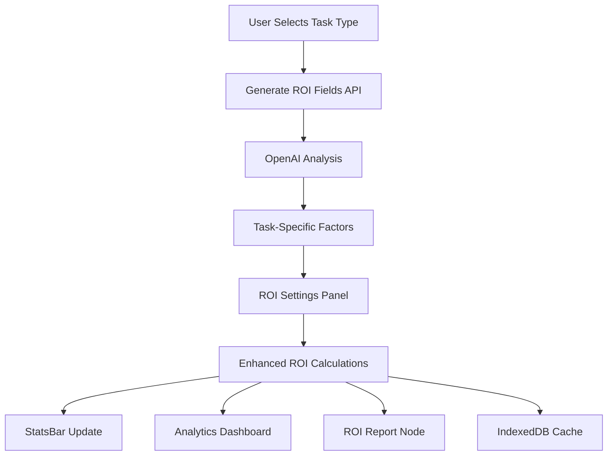

# ROI Enhancement Implementation Guide

**Version:** 1.0.0  
**Date:** January 2025  
**Project:** Apicus MVP - Intelligent ROI System

## 🎯 Overview

This guide provides comprehensive implementation details for enhancing the ROI calculation system with task-specific intelligent fields powered by OpenAI, expanding the ROI Settings Panel, and ensuring metrics propagate correctly throughout the application.

## 📐 Architecture Overview



## 🔧 Technical Stack

- **Frontend:** Next.js 15, React 19, TypeScript
- **State Management:** Dexie (IndexedDB), React Hooks
- **AI Integration:** Azure OpenAI API
- **UI Components:** shadcn/ui, Tailwind CSS v4
- **Calculations:** Custom ROI calculation engine

## 📊 Core ROI Formula Enhancement

### Base Formula
```typescript
// Traditional ROI
ROI = [(T × H × V*) + R + U] − C

// Enhanced ROI with Factors
ROI_enhanced = [(T × H × V* × Σ(PF_time)) + (R + Σ(PF_risk)) + (U + Σ(PF_revenue))] − [C + Σ(NF_costs)]

Where:
- PF = Positive Factors
- NF = Negative Factors
- Σ = Sum of impacts
```

### Factor Impact Calculation
```typescript
interface FactorImpact {
  baseMetric: 'time' | 'risk' | 'revenue' | 'cost';
  operation: 'multiply' | 'add' | 'subtract' | 'compound';
  value: number;
  unit: 'percentage' | 'currency' | 'hours' | 'score';
}

function applyFactor(baseValue: number, factor: FactorImpact): number {
  switch (factor.operation) {
    case 'multiply':
      return baseValue * (1 + factor.value / 100);
    case 'add':
      return baseValue + factor.value;
    case 'subtract':
      return baseValue - factor.value;
    case 'compound':
      return baseValue * Math.pow(1 + factor.value / 100, 1/12); // Monthly compound
    default:
      return baseValue;
  }
}
```

## 🎨 UI/UX Implementation Details

### ROI Settings Panel Expansion

```tsx
// ROISettingsPanel.tsx modifications
const panelVariants = {
  collapsed: {
    width: '480px',
  },
  expanded: {
    width: '50vw',
    maxWidth: '960px',
    minWidth: '640px',
  }
};

// New sections structure
<Sheet>
  <SheetContent className={isExpanded ? 'w-[50vw]' : 'w-[480px]'}>
    {/* Existing sections */}
    
    {/* New Task-Specific Factors Section */}
    <Accordion>
      <AccordionItem value="positive-factors">
        <AccordionTrigger>
          <TrendingUp className="mr-2" />
          Value Drivers ({positiveFactors.length})
        </AccordionTrigger>
        <AccordionContent>
          <div className="grid grid-cols-2 gap-4">
            {positiveFactors.map(factor => (
              <FactorCard key={factor.id} {...factor} />
            ))}
          </div>
        </AccordionContent>
      </AccordionItem>
      
      <AccordionItem value="negative-factors">
        <AccordionTrigger>
          <AlertTriangle className="mr-2" />
          Cost & Risk Factors ({negativeFactors.length})
        </AccordionTrigger>
        <AccordionContent>
          <div className="grid grid-cols-2 gap-4">
            {negativeFactors.map(factor => (
              <FactorCard key={factor.id} {...factor} variant="negative" />
            ))}
          </div>
        </AccordionContent>
      </AccordionItem>
    </Accordion>
  </SheetContent>
</Sheet>
```

### Factor Card Component

```tsx
interface FactorCardProps {
  id: string;
  label: string;
  description: string;
  value: number;
  defaultValue: number;
  min: number;
  max: number;
  unit: 'percentage' | 'currency' | 'number' | 'hours';
  impact: number; // Calculated impact in dollars
  variant?: 'positive' | 'negative';
  onChange: (value: number) => void;
}

const FactorCard: React.FC<FactorCardProps> = ({
  label,
  description,
  value,
  defaultValue,
  min,
  max,
  unit,
  impact,
  variant = 'positive',
  onChange
}) => {
  const isPositive = variant === 'positive';
  
  return (
    <Card className={cn(
      "p-4 space-y-3",
      isPositive ? "border-green-200 bg-green-50/50" : "border-red-200 bg-red-50/50"
    )}>
      <div className="flex justify-between items-start">
        <div className="flex-1">
          <Label className="font-semibold">{label}</Label>
          <p className="text-xs text-muted-foreground mt-1">{description}</p>
        </div>
        <Tooltip>
          <TooltipTrigger>
            <HelpCircle className="h-4 w-4 text-muted-foreground" />
          </TooltipTrigger>
          <TooltipContent>
            <p>Impact: {isPositive ? '+' : '-'}${Math.abs(impact).toLocaleString()}/mo</p>
            <p>Default: {defaultValue}{getUnitSymbol(unit)}</p>
          </TooltipContent>
        </Tooltip>
      </div>
      
      <div className="space-y-2">
        <div className="flex items-center gap-3">
          <Slider
            value={[value]}
            onValueChange={([v]) => onChange(v)}
            min={min}
            max={max}
            step={getStepSize(unit, max - min)}
            className="flex-1"
          />
          <Input
            type="number"
            value={value}
            onChange={(e) => onChange(Number(e.target.value))}
            className="w-20 text-right"
          />
          <span className="text-sm text-muted-foreground w-8">
            {getUnitSymbol(unit)}
          </span>
        </div>
        
        <div className={cn(
          "text-sm font-medium text-right",
          isPositive ? "text-green-600" : "text-red-600"
        )}>
          {isPositive ? '+' : '-'}${Math.abs(impact).toLocaleString()}/mo
        </div>
      </div>
    </Card>
  );
};
```

## 🔌 API Integration

### OpenAI Route Handler

```typescript
// app/api/openai/generate-roi-fields/route.ts
export async function POST(req: Request) {
  const {
    taskType,
    automationName,
    platform,
    runsPerMonth,
    minutesPerRun,
    hourlyRate,
    currentNetROI,
    workflowSteps
  } = await req.json();

  const systemPrompt = `You are an ROI optimization expert specializing in ${taskType} automation.
  Generate specific, measurable factors that impact ROI for this automation type.
  Base your suggestions on industry benchmarks and best practices.`;

  const userPrompt = `Generate ROI factors for:
  - Automation: ${automationName}
  - Type: ${taskType}
  - Platform: ${platform}
  - Scale: ${runsPerMonth} runs/month
  - Time saved: ${minutesPerRun} min/run
  - Current ROI: $${currentNetROI}/month
  
  Workflow involves: ${workflowSteps.map(s => s.appName).join(', ')}
  
  Provide 6 positive and 4 negative factors with realistic default values.`;

  const completion = await openai.createChatCompletion({
    model: "gpt-4-turbo-preview",
    messages: [
      { role: "system", content: systemPrompt },
      { role: "user", content: userPrompt }
    ],
    temperature: 0.7,
    response_format: { type: "json_object" }
  });

  return NextResponse.json(completion.data.choices[0].message.content);
}
```

## 📈 State Management

### Enhanced Scenario Interface

```typescript
interface EnhancedScenario extends Scenario {
  // Task-specific factors
  taskSpecificFactors?: {
    positive: Record<string, number>;
    negative: Record<string, number>;
    definitions: {
      positive: PositiveFactor[];
      negative: NegativeFactor[];
    };
    generatedAt?: Date;
    confidence: number;
  };
  
  // Calculated impacts
  factorImpacts?: {
    timeBoost: number;
    revenueBoost: number;
    riskReduction: number;
    additionalCosts: number;
    netImpact: number;
  };
}
```

### Custom Hook Implementation

```typescript
export function useEnhancedROI(scenario: Scenario) {
  const [factors, setFactors] = useState<TaskSpecificFactors>();
  const [isGenerating, setIsGenerating] = useState(false);
  
  const generateFactors = useCallback(async () => {
    setIsGenerating(true);
    try {
      const response = await fetch('/api/openai/generate-roi-fields', {
        method: 'POST',
        headers: { 'Content-Type': 'application/json' },
        body: JSON.stringify({
          taskType: scenario.taskType,
          automationName: scenario.name,
          platform: scenario.platform,
          runsPerMonth: scenario.runsPerMonth,
          minutesPerRun: scenario.minutesPerRun,
          hourlyRate: scenario.hourlyRate,
          currentNetROI: calculateNetROI(scenario),
          workflowSteps: extractWorkflowSteps(scenario.nodesSnapshot)
        })
      });
      
      const generatedFactors = await response.json();
      
      // Save to IndexedDB
      await db.scenarios.update(scenario.id, {
        taskSpecificFactors: generatedFactors
      });
      
      setFactors(generatedFactors);
    } finally {
      setIsGenerating(false);
    }
  }, [scenario]);
  
  const updateFactor = useCallback(async (factorId: string, value: number) => {
    // Update local state
    setFactors(prev => ({
      ...prev,
      [factorId]: value
    }));
    
    // Persist to IndexedDB
    await db.scenarios.update(scenario.id, {
      [`taskSpecificFactors.${factorId}`]: value
    });
    
    // Trigger recalculation
    recalculateROI();
  }, [scenario]);
  
  return {
    factors,
    isGenerating,
    generateFactors,
    updateFactor
  };
}
```

## 🎯 Performance Optimization

### Calculation Memoization

```typescript
const memoizedROICalculation = useMemo(() => {
  return calculateEnhancedROI({
    base: {
      T: runsPerMonth * minutesPerRun / 60,
      H: hourlyRate,
      V: taskMultiplier,
      R: riskValue,
      U: revenueValue,
      C: platformCost + appCosts
    },
    factors: taskSpecificFactors
  });
}, [
  runsPerMonth,
  minutesPerRun,
  hourlyRate,
  taskMultiplier,
  riskValue,
  revenueValue,
  platformCost,
  appCosts,
  taskSpecificFactors
]);
```

### Debounced Updates

```typescript
const debouncedFactorUpdate = useDebouncedCallback(
  (factorId: string, value: number) => {
    updateFactor(factorId, value);
  },
  300
);
```

## 🧪 Testing Considerations

### Unit Tests
- Factor calculation accuracy
- ROI formula with various factor combinations
- Edge cases (0 values, max values)

### Integration Tests
- API response handling
- State propagation across components
- IndexedDB persistence

### E2E Tests
- Complete factor generation flow
- Manual adjustment and recalculation
- Export with enhanced metrics

## 📝 Migration Strategy

### Database Migration

```typescript
// Dexie migration for new fields
db.version(9).stores({
  scenarios: '++id, slug, name, createdAt, updatedAt, taskSpecificFactors'
}).upgrade(tx => {
  return tx.scenarios.toCollection().modify(scenario => {
    scenario.taskSpecificFactors = {
      positive: {},
      negative: {},
      definitions: { positive: [], negative: [] },
      confidence: 0
    };
  });
});
```

## 🚀 Deployment Checklist

- [ ] API route created and tested
- [ ] OpenAI integration configured
- [ ] Database migration executed
- [ ] UI components implemented
- [ ] State management integrated
- [ ] Calculations verified
- [ ] Performance optimized
- [ ] Documentation updated
- [ ] Tests passing
- [ ] Feature flags configured

## 📚 Related Documents

- [Task-Specific ROI Factors Reference](./task-specific-roi-factors-reference.md)
- [ROI Formula v2 Specification](./roi-formula-v2.md)
- [API Integration Specification](./roi-api-integration-spec.md)
